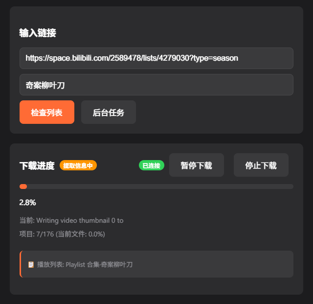
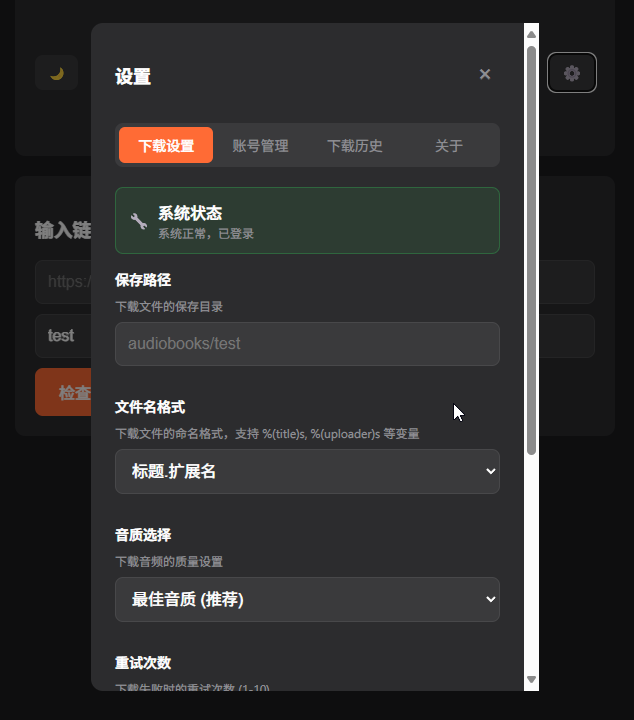
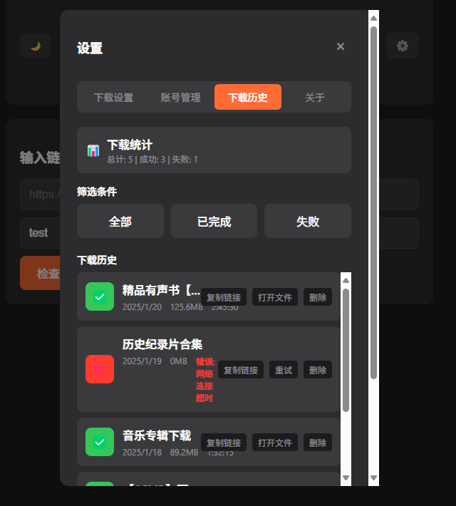
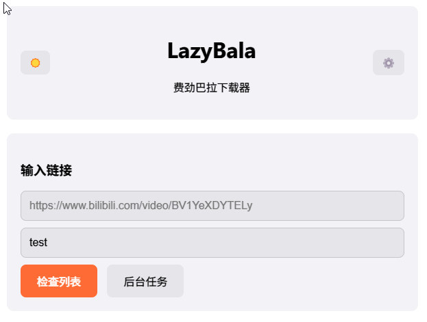
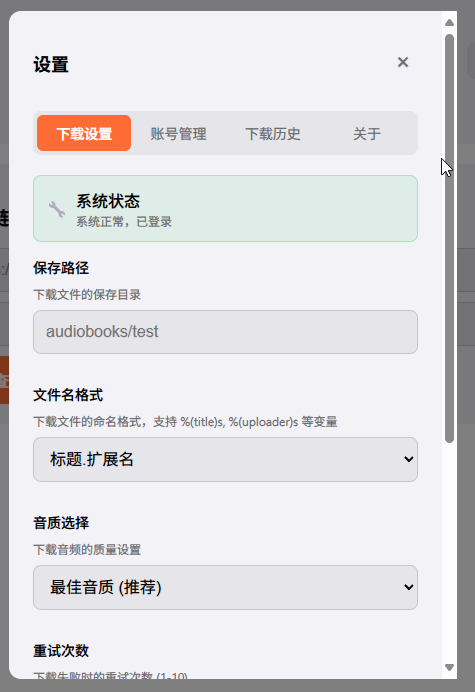

# LazyBala 🦫

<div align="center">

**基于 Go 和纯 JavaScript 的媒体下载应用**

支持 Bilibili 等平台的音频下载，具有现代化的 Web 界面和完整的自动化部署流程

[](https://github.com/kis2show/lazybala/releases)
[](https://hub.docker.com/r/kis2show/lazybala)
[](https://github.com/kis2show/lazybala/stargazers)
[](https://github.com/kis2show/lazybala/blob/main/LICENSE)
[](docs/SECURITY.md)

[📸 项目展示](#-项目展示) • [🚀 快速开始](#-快速开始) • [📦 安装方式](#-安装方式) • [🐳 Docker 部署](#-docker-部署) • [🛡️ 安全](#️-安全) • [📖 文档](#-文档) • [🤝 贡献](#-贡献)

</div>

---

## 📸 项目展示

<div align="center">

### 🏠 主界面
*简洁直观的下载界面，支持链接输入和一键下载*



### 🔐 登录界面
*扫码登录 Bilibili，安全便捷的身份验证*



### 📊 下载进度
*实时显示下载进度，支持暂停、恢复和停止操作*



### 📝 下载历史
*完整的下载记录管理，支持筛选和文件操作*



### ⚙️ 设置界面
*丰富的配置选项，支持主题切换和个性化设置*



</div>

---

## ✨ 功能特性

<div align="center">

<table>
<tr>
<td width="50%">

### 🎵 **媒体下载**
- **Bilibili 音频下载** - 支持单个视频和播放列表
- **高质量音频** - 自动选择最佳音质
- **断点续传** - 支持暂停和恢复下载
- **批量下载** - 支持播放列表批量下载

</td>
<td width="50%">

### � **用户认证**
- **QR 码登录** - 扫码快速登录 Bilibili
- **Cookie 管理** - 自动保存和验证登录状态
- **会话持久化** - 登录状态长期有效
- **安全可靠** - 本地存储，保护隐私

</td>
</tr>
<tr>
<td width="50%">

### � **现代化界面**
- **响应式设计** - 支持桌面和移动设备
- **实时进度** - WebSocket 实时显示下载进度
- **暗色模式** - 支持明暗主题切换
- **中文界面** - 完整的中文本地化

</td>
<td width="50%">

### 🌍 **多平台支持**
- **跨平台** - Linux、Windows、macOS、FreeBSD
- **多架构** - x64、ARM64、ARMv7
- **容器化** - Docker 和 Docker Compose 支持
- **一键安装** - 自动安装脚本

</td>
</tr>
</table>

### � **管理功能**
- **下载历史** - 完整的下载记录管理 • **进度监控** - 实时显示下载状态和速度 • **文件管理** - 自动组织下载的音频文件 • **配置管理** - 灵活的下载参数配置

</div>

## 🚀 快速开始

### Docker 运行（推荐）

```bash
# 使用 docker-compose
git clone https://github.com/kis2show/lazybala.git
cd lazybala
docker-compose up -d

# 或直接运行 Docker 镜像
docker run -d \
  --name lazybala \
  -p 8080:8080 \
  -v $(pwd)/audiobooks:/app/audiobooks \
  -v $(pwd)/config:/app/config \
  ghcr.io/kis2show/lazybala:latest
```

### 本地开发

#### 前置要求

- Go 1.21+
- Node.js 18+
- Git

#### 安装步骤

1. **克隆仓库**
   ```bash
   git clone https://github.com/kis2show/lazybala.git
   cd lazybala
   ```

2. **构建前端**
   ```bash
   cd frontend
   npm install
   npm run build
   cd ..
   ```

3. **安装 Go 依赖**
   ```bash
   go mod download
   ```

4. **运行应用**
   ```bash
   go run .
   ```

5. **访问应用**

   打开浏览器访问 `http://localhost:8080`

## 📖 使用说明

### 1. 扫码登录

首次使用需要扫码登录哔哩哔哩账号：

1. 点击"生成二维码"按钮
2. 使用哔哩哔哩 APP 扫描二维码
3. 在手机上确认登录
4. 登录成功后 cookies 会自动保存

### 2. 下载音频

1. **输入链接**: 在输入框中粘贴哔哩哔哩视频或合集链接
   - 普通视频: `https://www.bilibili.com/video/BV1KmzCYMEaq/`
   - 合集: `https://space.bilibili.com/2589478/lists/4279030?type=season`

2. **设置保存路径**: 可选择保存到 audiobooks 下的子文件夹

3. **高级设置**: 可自定义文件名格式
   - `%(title)s.%(ext)s` - 标题.扩展名
   - `%(uploader)s - %(title)s.%(ext)s` - 上传者 - 标题.扩展名

4. **开始下载**: 点击"开始下载"按钮

### 3. 监控进度

- 实时显示当前下载文件名和进度
- 显示下载速度和预计完成时间
- 合集下载时显示总体进度（n/总数）
- 支持缩略图预览

### 4. 配置管理

在设置页面可以：

- 设置默认保存路径
- 选择音频质量
- 自定义文件名格式
- 设置重试次数
- 检查和更新 yt-dlp 版本

## 🔧 配置说明

### 环境变量

| 变量名 | 默认值 | 说明 |
|--------|--------|------|
| `PORT` | `8080` | 服务端口 |
| `TZ` | `UTC` | 时区设置 |

### 目录结构

```
lazybala/
├── audiobooks/          # 下载的音频文件
├── config/             # 配置文件
│   ├── config.json     # 应用配置
│   └── yt.config       # yt-dlp 配置
├── cookies/            # 登录 cookies
│   └── cookies.txt     # 哔哩哔哩 cookies
├── bin/                # 二进制工具
│   ├── yt-dlp_linux    # yt-dlp (amd64)
│   ├── yt-dlp_linux_aarch64  # yt-dlp (arm64)
│   ├── ffmpeg_linux    # ffmpeg (amd64)
│   └── ffmpeg_linux_aarch64  # ffmpeg (arm64)
└── frontend/           # 前端文件
```

### 支持的链接格式

1. **普通视频**
   ```
   https://www.bilibili.com/video/BV1KmzCYMEaq/
   https://www.bilibili.com/video/BV1KmzCYMEaq?p=2
   ```

2. **合集/播放列表**
   ```
   https://space.bilibili.com/2589478/lists/4279030?type=season
   ```

3. **分享链接**
   ```
   分享地址：https://www.bilibili.com/video/BV1KmzCYMEaq?p=2/type=playlist
   ```

## 📚 文档

- [Docker 部署指南](DOCKER.md)
- [群晖 NAS 部署指南](docs/SYNOLOGY_DEPLOYMENT.md)
- [yt-dlp 升级指南](docs/YTDLP_UPGRADE.md)
- [v2.0 迁移指南](docs/MIGRATION_V2.md) 🆕
- [健康检查修复指南](docs/HEALTHCHECK_FIX.md) 🆕
- [API 文档](docs/API.md)

## 🛠️ 开发

### 技术栈

- **后端**: Go + Gin + WebSocket
- **前端**: Vue 3 + Vite + Pinia
- **工具**: yt-dlp + ffmpeg
- **容器**: Docker + Docker Compose

### API 接口

#### 登录相关
- `POST /api/qrcode/generate` - 生成登录二维码
- `POST /api/qrcode/scan` - 检查登录状态

#### 下载相关
- `POST /api/download` - 开始下载
- `GET /api/download/progress` - 获取下载进度
- `POST /api/download/stop` - 停止下载

#### 配置相关
- `GET /api/config` - 获取配置
- `POST /api/config` - 保存配置

#### 版本管理
- `GET /api/version/check` - 检查版本更新
- `POST /api/version/update` - 更新版本

### 构建

```bash
# 构建前端
cd frontend && npm run build

# 构建后端
go build -o lazybala .

# 构建 Docker 镜像
docker build -t lazybala .
```

## 🛡️ 安全

LazyBala 重视安全性，我们定期进行安全审计和依赖更新。

### 安全特性

- **自动依赖更新** - GitHub Actions 定期检查和更新依赖
- **安全扫描** - 使用 govulncheck、gosec 和 nancy 进行安全扫描
- **权限最小化** - Docker 容器使用非 root 用户运行
- **输入验证** - 所有用户输入都经过严格验证

### 安全审计

项目使用以下工具进行安全审计：

- **govulncheck** - Go 官方漏洞检查工具
- **gosec** - Go 安全代码分析器
- **nancy** - 依赖漏洞扫描器

### 报告安全问题

如果发现安全漏洞，请查看我们的 [安全政策](docs/SECURITY.md) 了解如何负责任地报告。

## 🤝 贡献

欢迎提交 Issue 和 Pull Request！

1. Fork 本仓库
2. 创建特性分支 (`git checkout -b feature/AmazingFeature`)
3. 提交更改 (`git commit -m 'Add some AmazingFeature'`)
4. 推送到分支 (`git push origin feature/AmazingFeature`)
5. 开启 Pull Request

## 📄 许可证

本项目采用 MIT 许可证 - 查看 [LICENSE](LICENSE) 文件了解详情。

## 🙏 致谢

- [yt-dlp](https://github.com/yt-dlp/yt-dlp) - 强大的视频下载工具
- [FFmpeg](https://ffmpeg.org/) - 多媒体处理框架
- [Vue.js](https://vuejs.org/) - 渐进式 JavaScript 框架
- [Gin](https://gin-gonic.com/) - Go Web 框架

## 📞 支持

如果你觉得这个项目有用，请给它一个 ⭐️！

如有问题或建议，请提交 [Issue](https://github.com/kis2show/lazybala/issues)。

---

**作者**: Kis2Show
**项目**: LazyBala - 费劲巴拉下载器
